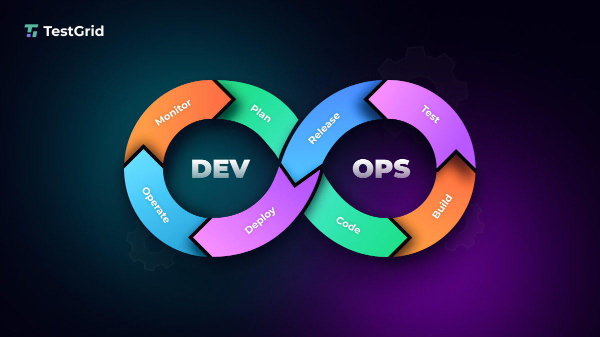
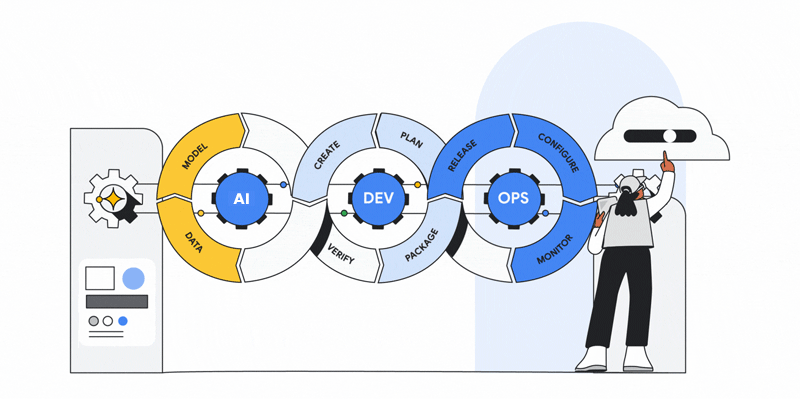
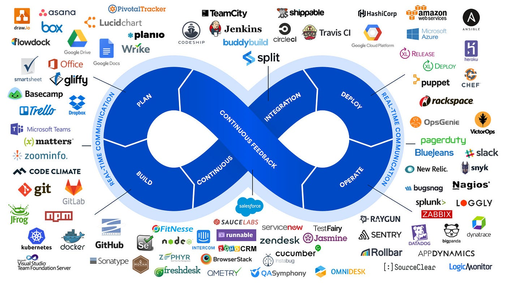

---

# **DevOps**

---

**DevOps** is a set of practices, cultural philosophies, and tools that aim to bridge the gap between **software development (Dev)** and **IT operations (Ops)**. The goal is to shorten the development lifecycle, deliver high-quality software quickly, and improve collaboration between development, operations, and other stakeholders.

---

# **Key Concepts in DevOps:**
**Continuous Integration (CI):**

CI is the practice of frequently merging code changes into a central repository.

Each integration is verified by an automated build and test process, allowing teams to detect issues early.

Tools like Jenkins, CircleCI, and GitHub Actions are often used for CI.

**Continuous Delivery (CD):**

CD ensures that the software is always in a deployable state.

After CI, the code can be automatically deployed to staging environments and sometimes even to production (Continuous Deployment).

Tools like Kubernetes, Docker, AWS CodePipeline, and Azure DevOps are widely used for CD.

**Infrastructure as Code (IaC):**

With IaC, infrastructure is managed and provisioned using code, rather than manual processes.

This makes it easy to scale, replicate environments, and maintain consistency across different stages of development.

Tools like Terraform, Ansible, and CloudFormation help in defining infrastructure as code.

**Monitoring & Logging:**

Monitoring and logging help track the health of your systems and applications in real-time.

Tools like Prometheus, Grafana, ELK Stack (Elasticsearch, Logstash, Kibana), and Datadog are used for monitoring, while logging tools like Splunk and Fluentd are also popular.

**Collaboration & Communication:**

DevOps promotes better collaboration between developers, IT operations, and other stakeholders.

Communication is often facilitated by tools like Slack, Microsoft Teams, and Jira.

**Automated Testing:**

Automated testing is crucial in DevOps to ensure that changes do not break the codebase.

Testing frameworks such as JUnit, Selenium, TestNG, and Cypress are commonly used.

**Containers and Orchestration:**

Containers like Docker allow developers to package applications with all their dependencies, making them portable across different environments.

Orchestration tools like Kubernetes manage these containers, ensuring they are deployed, scaled, and maintained correctly.

---

# **Popular DevOps Tools:**

  

**CI/CD Pipelines:**

1. Jenkins
2. GitLab CI
3. Travis CI
4. CircleCI

**Containerization & Orchestration:**

1. Docker
2. Kubernetes
3. OpenShift

**Version Control:**

Git (GitHub, GitLab, Bitbucket)

**Configuration Management & IaC:**

1. Terraform
2. Ansible
3. Chef
4. Puppet
5. Monitoring & Logging:
6. Prometheus
7. Grafana
8. ELK Stack
9. Datadog

**Cloud Platforms:**

1. AWS
2. Azure
3. Google Cloud

---

